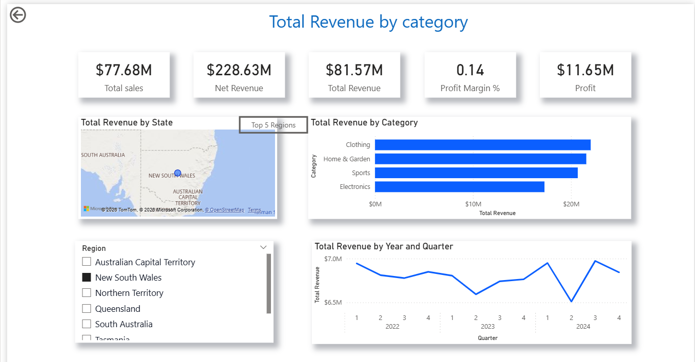

## Power BI File
Download the PBIX file:
https://1drv.ms/u/c/33a2a3f949db4d9a/IQAEtXLEoeGZSKw1CRw4jLmNATQpQasHlvdHkSLO4Mao-KM?e=sZ3lp4

# 📊 Power BI Sales Performance Dashboard

This Power BI project analyzes sales performance across products, regions, and customer segments.  
The dashboard provides clear insights into revenue trends, top‑performing categories, and key business drivers to support data‑driven decision‑making.

---

## 🚀 Project Overview
This dashboard was built to help stakeholders understand:

- Overall sales performance  
- Monthly revenue trends  
- Top‑selling products  
- Regional performance  
- Customer purchase patterns  

The goal is to provide a **single source of truth** for business leaders to monitor KPIs and identify growth opportunities.

---

## ❓ Business Questions Answered

- What is the total revenue generated over time?  
- Which products contribute the most to sales?  
- Which regions perform best or need improvement?  
- How do monthly sales trends compare?  
- Which customer segments drive the highest revenue?

---

## 🗂️ Dataset Information

The dataset includes:

- Sales transactions  
- Order details  
- Product information  
- Customer details  

📁 **Download Datasets (ZIP files):**  
- Sales Data  
- Orders Data  
- Customer Data  

*(All dataset files are included in this repository as ZIP files.)*

---

## 📈 Power BI Dashboard

You can view or download the interactive PBIX file here:

👉 **Power BI File:** *[Click to open PBIX] https://1drv.ms/u/c/33a2a3f949db4d9a/IQAEtXLEoeGZSKw1CRw4jLmNATQpQasHlvdHkSLO4Mao-KM?e=sZ3lp4*  

---

## 🛠️ Tools & Technologies Used

- **Power BI Desktop**  
- **Power Query** for data cleaning  
- **DAX** for calculated measures  
- **Excel / CSV** datasets  
- **Data modeling** (relationships, star schema)

---

## 🧮 Key DAX Measures

Some of the important measures used:

- Total Sales  
- Total Quantity  
- Monthly Sales Trend  
- Top Products by Revenue  
- Year‑to‑Date Sales  

---

## 🖼️ Dashboard Screenshots

### 📌 Overview Page
![Overview]Screenshot1.png

### 📌 Sales Analysis

### 📌 Product Performance

---

## 🧠 Insights Summary

- **Product Category A** generated the highest revenue.  
- **Region X** consistently outperformed other regions.  
- Sales peaked during **Month Y**, showing strong seasonal trends.  
- Customer Segment Z contributed the most to total revenue.  
- Opportunities exist to improve performance in low‑performing regions.

---

## 📬 Contact

If you’d like to connect or view more projects:

**GitHub:** https://app.notion.com/p/Dharini-Kumaresan-3749dfa19c9480cb85dac13f8f527f6a?source=copy_link 
**GitHub:** https://github.com/DhariniKumaresan

---

